# fedora-summer-ml-prep-2026

Pre-internship preparation repository for my 2026 Fedora ML/AI internship.

---

## Exploring RamaLama RAG

### Install RamaLama

To install RamaLama on a Fedora system, run:

```bash
sudo dnf install ramalama
```

To install RamaLama on another Linux distribution or using alternative methods, check the official installation guide:

[Install RamaLama](https://github.com/containers/ramalama?tab=readme-ov-file#install)

---

### Display RamaLama Version

```bash
ramalama version
```

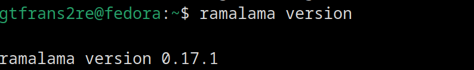

---

### About RamaLama RAG

`ramalama-rag` is a command-line tool built on top of RamaLama that converts documents into a Retrieval-Augmented Generation (RAG) database and packages it as a container image.

The architecture relies on two cooperating containers:

- A `llama.cpp` container responsible for serving AI models.
- A lightweight RAG container responsible for document ingestion, processing, chunking, embedding generation, and vector database creation.

---

## Document Processing & Retrieval Pipeline Architecture

### Pipeline Overview

```text
                 ┌──────────────────────────┐
                 │   Input Documents        │
                 │--------------------------│
                 │ .txt / .md / .html       │
                 │ PDFs                     │
                 │ Images                   │
                 └────────────┬─────────────┘
                              │
             ┌────────────────┴────────────────┐
             │                                 │
             ▼                                 ▼
┌─────────────────────────┐      ┌─────────────────────────┐
│ Direct Text Extraction  │      │ Granite Docling VLM     │
│-------------------------│      │ served via llama.cpp    │
│ Parse raw text files    │      │ Page-by-page OCR/VLM    │
└────────────┬────────────┘      └────────────┬────────────┘
             │                                │
             └────────────────┬───────────────┘
                              ▼
                 ┌──────────────────────────┐
                 │ Unified Document Content │
                 └────────────┬─────────────┘
                              ▼
                 ┌──────────────────────────┐
                 │ Section-Based Chunking   │
                 │--------------------------│
                 │ Chunk by headings and    │
                 │ semantic sections        │
                 └────────────┬─────────────┘
                              ▼
                 ┌──────────────────────────┐
                 │ Embedding Generation     │
                 │--------------------------│
                 │ EmbeddingGemma           │
                 │ served via llama.cpp    │
                 └────────────┬─────────────┘
                              ▼
                 ┌──────────────────────────┐
                 │ Vector Storage           │
                 │--------------------------│
                 │ Qdrant On-Disk           │
                 │ Collection               │
                 └────────────┬─────────────┘
                              ▼
                 ┌──────────────────────────┐
                 │ OCI Packaging            │
                 │--------------------------│
                 │ FROM scratch OCI Image   │
                 │ containing Qdrant DB     │
                 └──────────────────────────┘
```

---

### Convert a Single PDF

```bash
ramalama rag ./data/2305.14325v1.pdf ./ramalama-rag-output
```

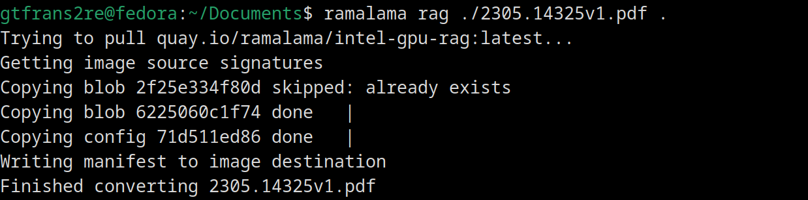

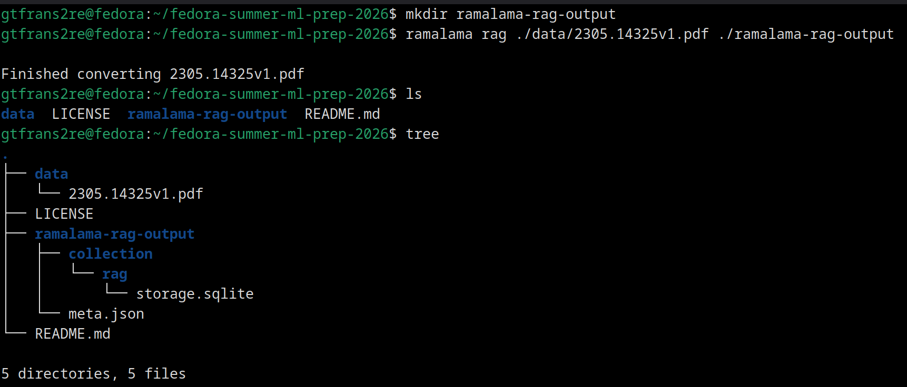

---

### Output After Successful Conversion

```text
.
├── data
│   ├── 2305.14325v1.pdf
│   ├── ramalama_docs_ramalama-rag.1.md at main · containers_ramalama.html
│   ├── schedule.txt
│   └── simple.txt
├── LICENSE
├── ramalama-rag-output
│   ├── collection
│   │   └── rag
│   │       └── storage.sqlite
│   └── meta.json
├── README.md
└── screenshots
    ├── intel_gpu_top.png
    ├── podman_pull_vlllm_openai.png
    ├── ramalama_dir_ragging.png
    ├── ramalama_rag_pdf_output.png
    ├── ramalama_rag_pfd.png
    ├── ramalama_run_gpt_oss.png
    ├── ramalama_serve_gpt_oss_ask.png
    ├── ramalama_serve_gpt_oss_response.png
    ├── ramalama_simple_txt_test.png
    ├── ramalama_version.png
    ├── ramalama_vllm_hpc_runtime_1.png
    ├── ramalama_vllm_hpc_runtime_2.png
    ├── ramalama_vllm_hpc_runtime_failed.png
    ├── rpmbuild_specs.png
    ├── rpmdev_setups_specs.png
    ├── rpmdevtools_install.png
    └── rpm_verify_run_app.png

6 directories, 25 files
```

### Convert a directory file content

As RamaLama RAG converts pdf, txt, and html files into a RAG image, we can simply run it on a directory and it will process its content and save the output.

```bash
ramalama rag ./data myrag:latest
```

* note that the data directory contains three files of PDF, TXT, and HTML format.

RamaLama-RAG successfully converted the PDF and the HTML files in the data directory, but got stuck in converting that of the txt file, which currently contains an ics calendar data content but saved as a txt file. It threw an this : `Error: File format not allowed: schedule.txt`.

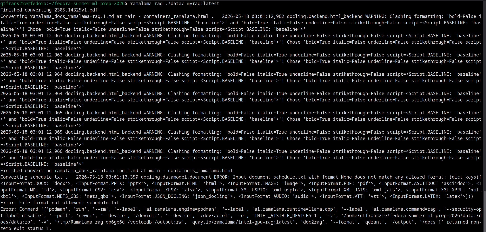

The hypothesis above was further invalidated by run it a simple 1-line text file and it failed again.
However, looking closely at the verbose output, we notice that txt type files are not allowed even though it is mentioned on the RamaLama RAG documentation page here: [https://github.com/containers/ramalama/blob/main/docs/ramalama-rag.1.md](https://github.com/containers/ramalama/blob/main/docs/ramalama-rag.1.md) that it is a supported format.

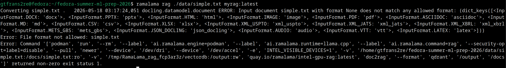

### Using a custom GPU or Graphics Accelerators

As my laptop has an Intel Corporation Meteor Lake-P `Intel Arc Graphics`, I tried this for high-performance computing.

By default, RamaLama uses `llama.cpp` to run models on your hardware. By passing --runtime=vllm, you instruct RamaLama to use `vLLM` as the underlying inference engine.Why use it? `vLLM` is designed for `high-performance enterprise workloads`. It uses techniques like PagedAttention to drastically increase generation speed and throughput, making it ideal if you need to serve multiple users simultaneously with low latency.

To do so:

```bash
ramalama --runtime=vllm rag ./data/ my-rag-image
```

In my case, it failed and returned `Error: unable to copy from source docker://vllm/vllm-openai:latest: copying system image from manifest list: reading blob sha256:0e0a2c237a999a7fa40dfdf77e0f8d5810bbc041b4012e71593f89081fc10709`.

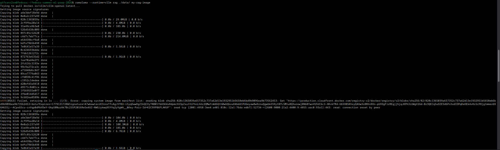

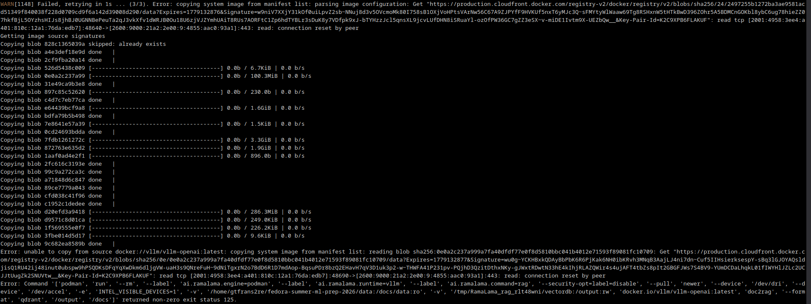

Pre-pulling the image manually fixed it for me:

```bash
podman pull docker.io/vllm/vllm-openai:latest
```

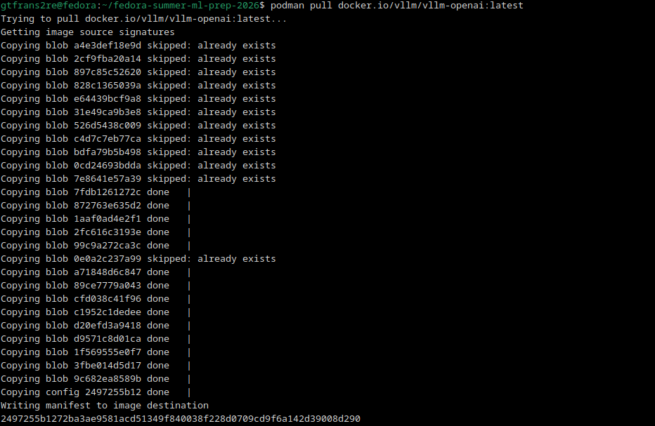

Yet, re-running: 

```bash
ramalama --runtime=vllm rag ./data/ my-rag-image
```

returned a `RuntimeError: Failed to infer device type`.

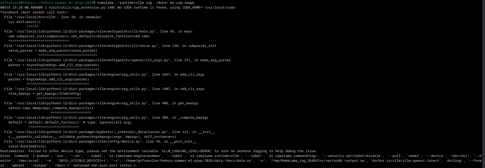

To monitor the Intel GPU usage on your system:

```bash
sudo intel_gpu_top
```

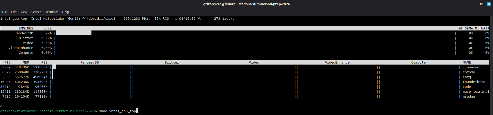

---

### Runnning the Hugging Face GPT-OSSS with RamaLama

To run the model locally, we need to do the following:

```bash
ramalama run gpt-oss
```

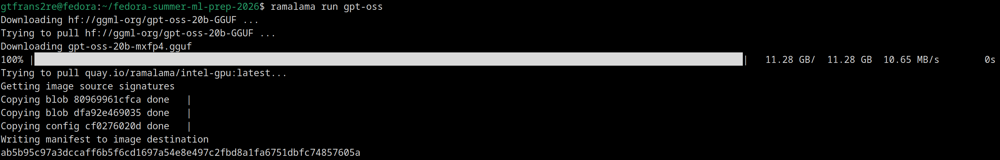

You can also supply a full model URL if you prefer to reference a specific location directly (for example, `hf://unsloth/gpt-oss-20b-GGUF`).

More about this on: [https://www.redhat.com/en/blog/run-containerized-ai-models-locally-ramalama](https://www.redhat.com/en/blog/run-containerized-ai-models-locally-ramalama)

Moreover, `ramalama serve` makes it possible to expose a local model through a REST endpoint, an interactive GUI that allows you to type in a prompt and get the model's answer to the prompt after reasoning with:

```bash
ramalama serve gpt-oss --port 8000
```


---

## RPM Packaging

### Getting to know the RPM Package Management System

Get to know better the Fedora RPM Package Management System at this URL: [https://packages.fedoraproject.org/pkgs/rpm/rpm/](https://packages.fedoraproject.org/pkgs/rpm/rpm/).

It is worth checking the [rpmlint](https://packages.fedoraproject.org/pkgs/rpmlint/rpmlint/), the Fedora Package Management tool for checking common errors in RPM packages.

### Simulation of the RPM based systems

RPM Packaging allows to package an application for RPM based systems, which then advantageously :

- it puts together code, data, config files and post-installations scripts.
- the package can be signed, therefore clients can verify that the package was not altered.
- it standardize installation paths.
- it describes requirements, which are automatically resolved by system.
- it allows easy installation/upgrade/removal of your application. 

Source: [https://developer.fedoraproject.org/deployment/rpm/about.html](https://developer.fedoraproject.org/deployment/rpm/about.html)

Example Setup Instructions:

```bash
sudo dnf install fedora-packager rpmdevtools gcc
```

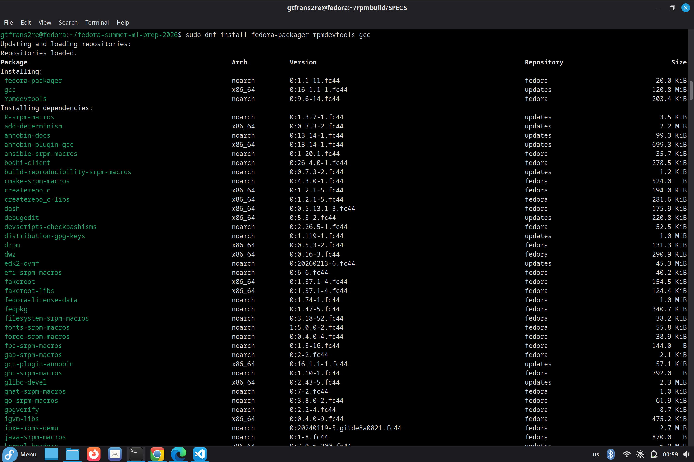

```bash
rpmdev-setuptree
cd ~/rpmbuild/SOURCES
wget http://ftp.gnu.org/gnu/hello/hello-2.10.tar.gz
cd ~/rpmbuild/SPECS
rpmdev-newspec --macros hello.spec
```

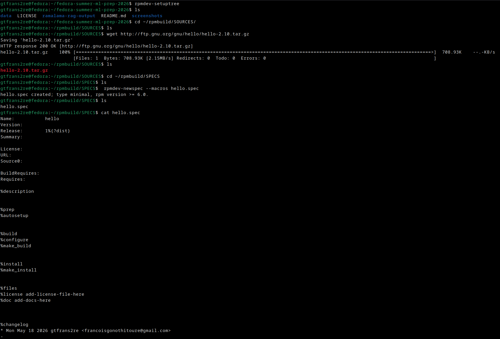

Sample content of the `hello.spec` file:

```text
Name:           hello
Version:        2.10
Release:        1%{?dist}
Summary:        The GNU Hello program

License:        GPLv3+
URL:            http://ftp.gnu.org/gnu/hello
Source0:        http://ftp.gnu.org/gnu/hello/%{name}-%{version}.tar.gz

BuildRequires:  gcc, make       

%description
The GNU Hello program produces a familiar, friendly greeting.

%prep
%autosetup

%build
%configure
%make_build

%install
%make_install
%find_lang %{name}

%files -f %{name}.lang
%license COPYING
%doc README AUTHORS ChangeLog NEWS
%{_bindir}/hello
%{_infodir}/hello.info*
%{_mandir}/man1/hello.1*

%changelog
* Mon May 18 2026 gtfrans2re <your-email-id> - 2.10-1
- Initial package build for GNU Hello
```

To run the `hello.spec` file:

```bash
rpmbuild -ba hello.spec
```

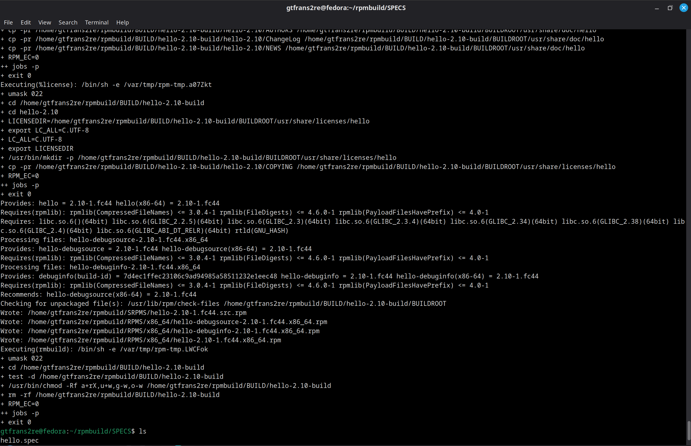

To verify and run the RPM Packaged application:

```bash
ls -l ~/rpmbuild/RPMS/x86_64/
sudo dnf install ~/rpmbuild/RPMS/x86_64/hello-2.10-1.fc44.x86_64.rpm
hello
```

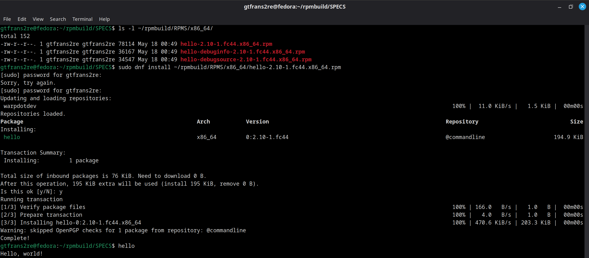

